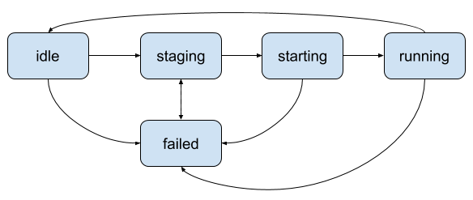

# Rhythm [](https://goreportcard.com/report/github.com/mlowicki/rhythm) [](https://travis-ci.org/mlowicki/rhythm)

## Features

* Support for [Docker](https://mesos.apache.org/documentation/latest/docker-containerizer/) and [Mesos](https://mesos.apache.org/documentation/latest/mesos-containerizer/) Containerizers 
* Integration with [HashiCorp Vault](https://www.vaultproject.io/) for secrets management
* Access control list (ACL) backed by [GitLab](https://gitlab.com/) or LDAP
* [Cron syntax](http://www.nncron.ru/help/EN/working/cron-format.htm)
* Integration with [Sentry](https://sentry.io/) for error tracking
* Command-line client ([Documentation](#command-line-client))
* Support for Linux and OSX

## Life cycle of a Job

* job - periodic action to perform (e.g. database backup).
* task - single run (instance) of job. If task fails and job allows for retries then new task will be launched.

Job is always in one of the following states:
* idle - either job hasn't been scheduled yet or its last run (task) was successful.
* staging - task (job's run) has been scheduled to run in response to received offer. Job moves to this state in parallel with sending to Mesos request to run task.
* starting - executor has learned about the task but has not yet started to run it.
* running - task (job's run) begun running successfully.
* failed - last job's task aborted with error. Failed job can be retried up-to `maxretries` times.



## Running the server

Rhythm server can be started with:
```
rhythm server -config=/etc/rhythm/config.json
```

Server is configured using file in JSON format. By default `config.json` from the current directory is used but it can overwritten using `-config` parameter. List of available configuration options is available [here](docs/server_config.md).

Documentation for server API is available [here](https://mlowicki.github.io/rhythm/api).

## Command-line client
Rhythm binary besides running in server mode provides also CLI tool. To see the list of available commands use `-help`. There is also [interactive client](#client) with auto-completion.

Address of Rhythm server is set either via `-addr` flag or `RHYTHM_ADDR` environment variable. If both are set then flag takes precedence.

Authentication method is set either via `-auth` flag or `RHYTHM_AUTH` environment variable. If both are set then flag takes precedence. Possible values are `gitlab` or `ldap`. No method set means no authentication.

To not enter GitLab access token every time, use [update-token](#update-token) command.

### health
Provides basic information about state of the server.

Examples:

```
$ rhythm health -addr https://example.com
Leader: true
Version: 0.5
ServerTime: Mon Nov 12 20:15:49 CET 2018
```

```
$ RHYTHM_ADDR=https://example.com rhythm health
Leader: true
Version: 0.5
ServerTime: Mon Nov 12 23:53:11 CET 2018
```

### read-job
Shows configuration and state of job with the given fully-qualified ID.

Example:
```
$ rhythm read-job -addr https://example.com group/project/id
State: Idle
    Last start: Mon Nov 12 20:17:22 CET 2018
Scheduler: Cron
    Rule: */1 * * * *
    Next start: Mon Nov 12 20:18:00 CET 2018
Container: Docker
    Image: alpine:3.8
    Force pull image: false
Cmd: /bin/sh -c 'echo $FOO'
Environment:
    FOO: foo
User: someone
Resources:
    Memory: 1024.0 MB
    Disk: 0.0 MB
    CPUs: 1.0
```

### read-tasks
Shows tasks (runs) of job with the given fully-qualified ID.

Example:
```
$ rhythm read-tasks -addr https://example.com group/project/id
Status:         SUCCESS
Start:          Wed Nov 14 23:38:51 CET 2018
End:            Wed Nov 14 23:38:51 CET 2018
Task ID:        group:project:id:7eb8d4fa-f133-4880-9840-f8f62d3d06b2
Executor ID:    group:project:id:7eb8d4fa-f133-4880-9840-f8f62d3d06b2
Agent ID:       18fd8e84-9213-4f51-9343-bae8b9c517fe-S0
Framework ID:   18fd8e84-9213-4f51-9343-bae8b9c517fe-0000
Executor URL:   https://example.com:5050/#/agents/18fd8e84-9213-4f51-9343-bae8b9c517fe-S0/frameworks/18fd8e84-9213-4f51-9343-bae8b9c517fe-0000/executors/group:project:id:7eb8d4fa-f133-4880-9840-f8f62d3d06b2

Status:         FAIL
Start:          Wed Nov 14 23:41:06 CET 2018
End:            Wed Nov 14 23:41:06 CET 2018
Message:        Reading secret failed: Get https://example.com/v1/secret/rhythm/group/project/foo: dial tcp [::1]:8200: connect: connection refused
Reason:         Failed to create task
Source:         Scheduler

Status:         FAIL
Start:          Wed Nov 14 23:43:06 CET 2018
End:            Wed Nov 14 23:43:06 CET 2018
Message:        Reading secret failed: Get https://example.com/v1/secret/rhythm/group/project/foo: dial tcp [::1]:8200: connect: connection refused
Reason:         Failed to create task
Source:         Scheduler

Status:         FAIL
Start:          Wed Nov 14 23:51:04 CET 2018
End:            Wed Nov 14 23:51:04 CET 2018
Task ID:        group:project:id:504d8c5c-f4d1-41f6-8797-c608bee7195b
Executor ID:    group:project:id:504d8c5c-f4d1-41f6-8797-c608bee7195b
Agent ID:       18fd8e84-9213-4f51-9343-bae8b9c517fe-S0
Framework ID:   18fd8e84-9213-4f51-9343-bae8b9c517fe-0000
Executor URL:   https://example.com:5050/#/agents/18fd8e84-9213-4f51-9343-bae8b9c517fe-S0/frameworks/18fd8e84-9213-4f51-9343-bae8b9c517fe-0000/executors/group:project:id:504d8c5c-f4d1-41f6-8797-c608bee7195b
Message:        Container exited with status 127
Reason:         REASON_COMMAND_EXECUTOR_FAILED
Source:         SOURCE_EXECUTOR
```

### delete-job
Remove job with the given fully-qualified ID.

Example:
```
$ rhythm delete-job -addr https://example.com group/project/id
```

### create-job
Add new job specified by config file.

Example:
```
$ rhythm create-job --addr=https://example.com echo.json
```

echo.json:
```javascript
{
    "id": "id",
    "group": "group",
    "project": "project",
    "cpus": 1,
    "mem": 1024,
    "cmd": "echo $FOO",
    "user": "someone",
    "env": {
        "FOO": "bar"
    },
    "schedule": {
        "cron": "*/1 * * * *"
    },
    "container": {
        "docker": {
            "image": "alpine:3.8"
        }
    }
}
```

### update-job
Modify job with config file containing job's parameters to change.
Can we launched with either one arguments or two. If one argument is set then it must be path to job config file which contains also job's group, project and ID. If two arguments are set then first one must be fully-qualified ID (e.g. "group/project/id") and second one path to job config file.
Only parameters form config file will be changed - absent parameters wont' be modified.

Examples:
```
$ rhythm update-job --addr=https://example.com group/project/id diff.json
```

diff.json:
```javascript
{
    "user": "root"
}
```

```
$ rhythm update-job --addr=https://example.com diff.json
```

diff.json:
```javascript
{
    "group": "group",
    "project": "project",
    "id": "id",
    "user": "root"
}
```

### run-job
Schedule job with the given fully-qualified ID for immediate run.
If job is already queued (scheduled but not launched yet) then command will be no-op.

Example:
```
$ rhythm run-job -addr https://example.com group/project/id
```

### find-jobs
Show IDs of jobs matching FILTER.

FILTER can be one of:
* GROUP to return all jobs from group
* GROUP/PROJECT to return all jobs from project
* no set to return all jobs across all groups and projects

Examples:
```
$ rhythm find-jobs --addr=https://example.com
group:project:id Idle
group:project:id2 Idle
group:project2:id Running
group2:project:id Failed
```

```
$ rhythm find-jobs --addr=https://example.com group
group:project:id Idle
group:project:id2 Running
group:project2:id Failed
```

```
$ rhythm find-jobs --addr=https://example.com group/project
group:project:id Idle
group:project:id2 Idle
```

## update-token
Update (or set) authz token. Used to save token so subsequent commands requiring authorization won't require to enter token every time.
By default it stores token on disk in the `~/.rhythm-token` file but it can be changed via the use of [token helper](./token_helper.md).

Example:
```
$ rhythm update-token
Token:
```

## client
Start interactive client. To see list of top-level commands press tab or space key.

Examples:
```
$ rhythm client
```


